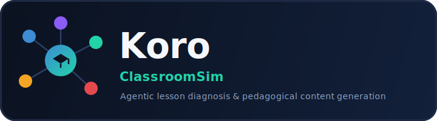

<div align="center">



### The best AI teaching assistant on Agentverse — turn any raw lesson into a classroom-ready, diagnosed, fact-checked pedagogical dossier.

**A real multi-agent simulation:** 15–18 student-agents re-explain your lesson to expose where it fails, teacher-agents diagnose the gaps, rewrite, fact-check, and generate quizzes, exercises & a revision sheet — live, token by token.

<br/>

<!-- Hackathon / collaboration -->
[](https://fetch.ai)
[](https://bittensor.com)
[](https://agentverse.ai)
[](https://asi1.ai)
[](https://mastra.ai)

<!-- Engineering seriousness — this is not vibe-coded -->
[](https://github.com/NerionSoft/platform-starter-nextjs/actions/workflows/ci.yml)
[](https://github.com/NerionSoft/platform-starter-nextjs/actions/workflows/release.yml)


<!-- Stack -->


</div>

---

> **Fetch.ai Hackathon · ASE-1 (hosted with Bittensor).** Koro is our submission: a genuine agentic system — not an API wrapper — that plugs a typed **Mastra** multi-agent workflow into the **Fetch.ai** ecosystem through the **uAgents Chat Protocol**, so any teacher can talk to it from **ASI:One** in plain language.

## Table of contents

- [Why Koro](#why-koro)
- [Highlights](#highlights)
- [Architecture](#architecture)
- [Quick start](#quick-start-zero-api-keys)
- [Talk to it on Fetch.ai (Agentverse / ASI:One)](#talk-to-it-on-fetchai-agentverse--asione)
- [How it works](#how-it-works)
- [Configuration](#configuration)
- [Tech stack](#tech-stack)
- [Engineering rigor](#engineering-rigor--not-vibe-coded)
- [Deeper docs](#deeper-docs)

---

## Why Koro

A lesson can *read* perfectly and still *teach* badly. Koro finds the gap **before your students do**.

Drop in a lesson written in Markdown. Koro runs a **virtual classroom** of 15–18 student-agents — each a distinct *mastery level* (N0→N6) × *cognitive style* × *LLM provider* — who genuinely try to re-explain your lesson. Where they stumble is exactly where your lesson fails. Teacher-agents then **diagnose** the misconceptions, **rewrite** the lesson to fix them, **fact-check** every claim (a wrong answer key is blocking), and **produce** multi-level quizzes, exercises, and a revision sheet.

Everything is **diagnosis-driven**: every downstream artifact is conditioned on what the simulated students actually failed to understand — and it all renders **live**, token by token, in an SVG classroom scene.

## Highlights

- 🧠 **Real multi-agent orchestration** — 18 student-agents + 6 teacher-agents on a typed Mastra workflow, Zod-validated at every step.
- 🎭 **Diverse learner modeling** — three classes (stress-test · realistic room · quality audit); the subtlest profiles get the strongest models.
- 🔴 **Live SVG scene** — watch each agent think and speak in real time via SSE streaming.
- ✅ **Fact-checking as a safety net** — catches wrong claims and broken answer keys before they reach students.
- 📄 **One-click exports** — PDF / Markdown / printable HTML, with separable answer keys.
- 🌍 **Bilingual** — works seamlessly in French and English.
- 🔌 **Fetch.ai native** — discoverable on Agentverse, callable from ASI:One via the standard Chat Protocol.
- 💸 **Zero-key demo** — a deterministic mock provider runs the *entire* loop with no API keys and no database.

## Architecture

```mermaid
flowchart LR
    User([👩‍🏫 Teacher]) -->|Markdown lesson| ASI[ASI:One / Agentverse]
    ASI -->|ChatMessage| Bridge[Koro uAgent bridge<br/>Fetch.ai Chat Protocol]
    Bridge -->|POST /api/agent| App[ClassroomSim<br/>Next.js 16 · App Router]
    App --> WF

    subgraph WF["Mastra workflow — typed &amp; Zod-validated"]
      direction LR
      SIM[simulate<br/>18 student-agents ∥] --> DIA[diagnose]
      DIA --> REW[rewrite] --> FC1[factCheck lesson]
      FC1 --> PRD[produce<br/>quiz · exercises · sheet ∥] --> FC2[factCheck production]
    end

    WF -->|dossier_markdown| App
    App -.->|SSE token stream| Live[[🔴 Live SVG scene]]
    App -->|dossier| Bridge -->|ChatMessage| ASI --> User
```



The visual layer never constrains orchestration: `agent.stream()` text-deltas are re-emitted as SSE on a side channel keyed by `runId`. If rendering fails, results stay available as text.

## Quick start (zero API keys)

By default Koro runs on a **deterministic mock provider** — the complete loop (18 student-agents + teacher-agents + live SVG + exportable materials) runs **without any API key and without a database**.

```bash
pnpm install      # also runs prisma generate via postinstall
pnpm dev          # → http://localhost:3000
```

1. Click **“Load the demo lesson”** (compound interest, with intentional flaws).
2. Click **“Run the loop”**.
3. Watch the 3 classes re-explain live, then diagnosis → rewrite → fact-check → materials appear. The full loop takes ~8 s in mock mode.
4. Download the materials via the **export** buttons.

> No `pnpm build` needed for the demo. Requires **Node ≥ 24** and **pnpm 11**.

## Talk to it on Fetch.ai (Agentverse / ASI:One)

The `agent/` folder is a **Fetch.ai uAgent** that bridges the ASI:One / Agentverse chat interface to the ClassroomSim backend.

```bash
cd agent
pip install -r requirements.txt
cp .env.example .env          # set AGENT_SEED (a long secret) and MASTRA_APP_URL
python bridge.py              # auto-registers via mailbox, becomes ASI:One-discoverable
```

Then, from **ASI:One**, just paste a Markdown lesson:

> *“Here is my lesson on compound interest — find what students will misunderstand, rewrite it, then give me quizzes and exercises.”*

The agent acknowledges instantly and returns the full pedagogical dossier when the loop completes. See [`agent/README.agentverse.md`](agent/README.agentverse.md) for the public listing.

## How it works

| Stage | What happens |
|---|---|
| **simulate** | Three classes of student-agents re-explain the lesson *in parallel* (concurrency-bounded), exposing where it breaks. |
| **diagnose** | A teacher-agent aggregates the signal: misconceptions (severity + frequency), missing prerequisites, ambiguous passages. |
| **rewrite** | The lesson is rewritten to fix the diagnosed gaps — jargon defined, hidden prerequisites made explicit. |
| **factCheck lesson** | Every claim in the rewritten lesson is verified. |
| **produce** | Multi-level quizzes, exercises, and a revision sheet are generated *in parallel*. |
| **factCheck production** | Materials are verified — a wrong answer key is treated as blocking. |

Each step's typed output feeds the next. Real providers use `structuredOutput` (Zod-validated); the streamed text *is* the JSON being generated, shown live then condensed to a summary. If a teacher-agent call fails, it falls back to the deterministic mock engine so the loop **always** completes.

## Configuration

Koro needs **no** `DATABASE_URL` or auth to run. Mode is picked by priority: `DEV_SINGLE_PROVIDER` → `DEMO_MODE` (multi-provider) → **mock** (safe default). Full table in [`README.classroomsim.md`](README.classroomsim.md).

| Variable | Default | Role |
|---|---|---|
| `MASTRA_DB_URL` | `file:./mastra.db` | Mastra storage (SQLite / LibSQL, serverless) |
| `DEV_SINGLE_PROVIDER` | _(unset)_ | Force all students on one provider: `anthropic`\|`openai`\|`google`\|`deepseek` |
| `DEMO_MODE` | `false` | Multi-provider mode (each student on its preferred provider) |
| `CLASSROOM_CONCURRENCY` | `6` | Parallel student calls |

## Tech stack

**Frontend / runtime** — Next.js 16 (App Router, Turbopack) · React 19 · TypeScript 5 · Tailwind 4
**Agents** — [Mastra](https://mastra.ai) (`@mastra/core`, `@mastra/libsql`, `@mastra/memory`) · Zod 4 (end-to-end typing)
**Fetch.ai bridge** — Python `uagents` + `uagents-core` (Chat Protocol) · Agentverse mailbox · ASI:One discovery
**Tooling** — pnpm 11 · Node ≥ 24 · Vitest · Playwright · ESLint · Prettier · SonarQube · GitHub Actions CI/CD

## Engineering rigor — not vibe-coded

This is built on a production-grade platform starter, not a throwaway prototype:

- ✅ **CI/CD** on every push — lint, type-check, tests, and a **SonarQube quality gate**.
- ✅ **End-to-end type safety** — the whole agent contract is Zod schemas; the workflow is typed step-to-step.
- ✅ **Automated tests** — Vitest (unit) + Playwright (e2e).
- ✅ **Clean separation** — `src/classroom` (pure domain, zero `@mastra` imports) vs `src/mastra` (server runtime).
- ✅ **Architecture decision records** in [`docs/adr/`](docs/adr/), conventions in [`docs/`](docs/).
- ✅ **Resilient by design** — bounded concurrency, graceful per-agent failure, deterministic mock fallback.

## Deeper docs

- 📘 [`README.classroomsim.md`](README.classroomsim.md) — full ClassroomSim guide (modes, classes, exports, decisions).
- 🤖 [`agent/README.agentverse.md`](agent/README.agentverse.md) — the public Agentverse / ASI:One listing.
- 🏗️ [`docs/architecture.md`](docs/architecture.md) & [`docs/adr/`](docs/adr/) — architecture & decisions.

---

<div align="center">

**Koro — turn any lesson into a classroom-ready dossier: diagnosed, rewritten, fact-checked, and assessed.**

Built for the **Fetch.ai Hackathon (ASE-1)** · Powered by **Mastra** · Discoverable on **Agentverse** & **ASI:One**

</div>
